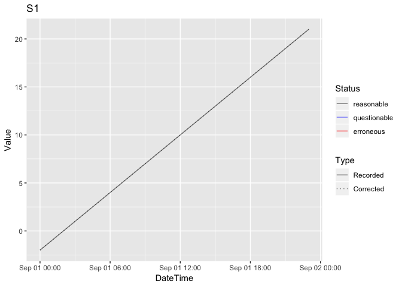

<!-- README.md is generated from README.Rmd. Please edit that file -->
<!-- badges: start -->

<!-- badges: end -->

# tsdbr

`tsdbr` is designed to create, populate, maintain and query SQLite
databases of environmental time series data.

## Utilisation

    library(tsdbr)
    conn <- ts_create_db(":memory:")
    options(tsdbr.conn = conn)
    ts_add_parameter("discharge", "cms")
    ts_add_site("Niagara Falls")
    ts_add_station("S1", "discharge", "Niagara Falls", "hour")
    data <- data.frame(
      Station = "S1", DateTime = ISOdate(2000, 9, 1, 0:23),
      Recorded = 0:23 - 2,
      stringsAsFactors = FALSE
    )
    ts_add_data(data)
    data <- ts_get_data(
      start_date = as.Date("2000-09-01"),
      end_date = as.Date("2000-09-02")
    )
    print(head(data))
    #> # A tibble: 6 × 11
    #>   Station DateTime            Recorded Corrected Status     Site          Depth Parameter Units StationName Comments
    #>   <chr>   <dttm>                 <dbl>     <dbl> <ord>      <chr>         <dbl> <chr>     <chr> <chr>       <chr>   
    #> 1 S1      2000-09-01 00:00:00       -2        -2 reasonable Niagara Falls    NA discharge cms   <NA>        <NA>    
    #> 2 S1      2000-09-01 01:00:00       -1        -1 reasonable Niagara Falls    NA discharge cms   <NA>        <NA>    
    #> 3 S1      2000-09-01 02:00:00        0         0 reasonable Niagara Falls    NA discharge cms   <NA>        <NA>    
    #> 4 S1      2000-09-01 03:00:00        1         1 reasonable Niagara Falls    NA discharge cms   <NA>        <NA>    
    #> 5 S1      2000-09-01 04:00:00        2         2 reasonable Niagara Falls    NA discharge cms   <NA>        <NA>    
    #> 6 S1      2000-09-01 05:00:00        3         3 reasonable Niagara Falls    NA discharge cms   <NA>        <NA>
    ts_plot_data(data)

    ts_disconnect_db()

## Installation

To install the latest version from GitHub
[repository](https://github.com/poissonconsulting/tsdbr)

    # install.packages("remotes")
    remotes::install_github("poissonconsulting/tsdbr")

## Contribution

Please report any
[issues](https://github.com/poissonconsulting/tsdbr/issues).

[Pull requests](https://github.com/poissonconsulting/tsdbr/pulls) are
always welcome.

## Code of Conduct

Please note that the tsdbr project is released with a [Contributor Code
of
Conduct](https://contributor-covenant.org/version/2/0/CODE_OF_CONDUCT.html).
By contributing to this project, you agree to abide by its terms.
