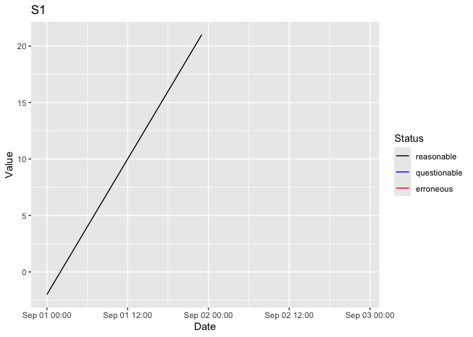

<!-- README.md is generated from README.Rmd. Please edit that file -->

[](https://www.tidyverse.org/lifecycle/#experimental)
[](https://travis-ci.org/poissonconsulting/tsdbr)
[](https://codecov.io/github/poissonconsulting/tsdbr?branch=master)
[](https://opensource.org/licenses/MIT)

# tsdbr

`tsdbr` is designed to create, populate, maintain and query SQLite
databases of environmental time series data.

## Utilisation

``` r
library(tsdbr)
conn <- ts_create_db(":memory:")
options(tsdbr.conn = conn)
ts_add_parameter("discharge", "cms")
ts_add_site("Niagara Falls")
ts_add_station("S1", "discharge", "Niagara Falls", "hour")
data <- data.frame(Station = "S1", DateTime = ISOdate(2000, 9, 1, 0:23),
                   Recorded = 0:23 - 2,
                   stringsAsFactors = FALSE)
ts_add_data(data)
data <- ts_get_data(start_date = as.Date("2000-09-01"),
                    end_date = as.Date("2000-09-02"))
print(head(data))
#>   Station            DateTime Recorded Corrected     Status Comments
#> 1      S1 2000-09-01 00:00:00       -2        -2 reasonable     <NA>
#> 2      S1 2000-09-01 01:00:00       -1        -1 reasonable     <NA>
#> 3      S1 2000-09-01 02:00:00        0         0 reasonable     <NA>
#> 4      S1 2000-09-01 03:00:00        1         1 reasonable     <NA>
#> 5      S1 2000-09-01 04:00:00        2         2 reasonable     <NA>
#> 6      S1 2000-09-01 05:00:00        3         3 reasonable     <NA>
ts_plot_data(data)
```



``` r
ts_disconnect_db()
```

## Installation

To install the latest version from the Poisson drat
[repository](https://github.com/poissonconsulting/drat)

``` r
# install.packages("drat")
drat::addRepo("poissonconsulting")
install.packages("tsdbr")
```

To install the latest development version from
[GitHub](https://github.com/poissonconsulting/tsdbr)

``` r
# install.packages("devtools")
devtools::install_github("poissonconsulting/tsdbr")
```

## Citation

``` 

To cite package 'tsdbr' in publications use:

  Joe Thorley (2018). tsdbr: Environmental Time Series Databasing.
  R package version 0.0.0.9011.

A BibTeX entry for LaTeX users is

  @Manual{,
    title = {tsdbr: Environmental Time Series Databasing},
    author = {Joe Thorley},
    year = {2018},
    note = {R package version 0.0.0.9011},
  }
```

## Contribution

Please report any
[issues](https://github.com/poissonconsulting/tsdbr/issues).

[Pull requests](https://github.com/poissonconsulting/tsdbr/pulls) are
always welcome.

Please note that this project is released with a [Contributor Code of
Conduct](CONDUCT.md). By participating in this project you agree to
abide by its terms.
